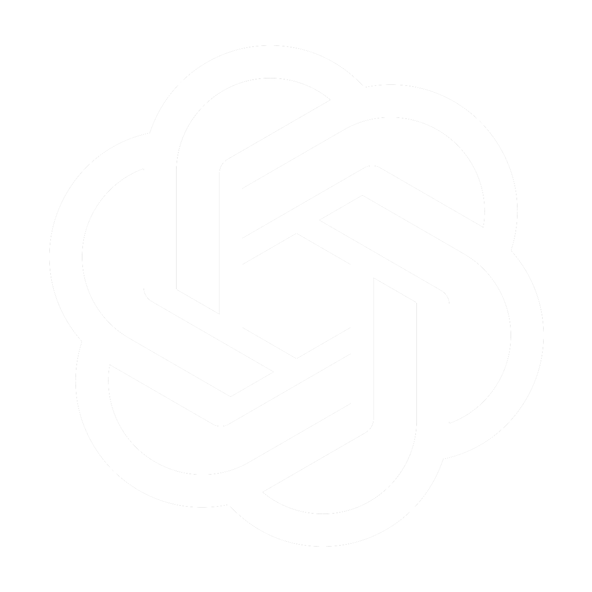

<!--START_SECTION:waka-->


**I'm an Early 🐤** 

```text
🌞 Morning    92 commits     ███████░░░░░░░░░░░░░░░░░░   28.93% 
🌆 Daytime    68 commits     █████░░░░░░░░░░░░░░░░░░░░   21.38% 
🌃 Evening    152 commits    ████████████░░░░░░░░░░░░░   47.8% 
🌙 Night      6 commits      ░░░░░░░░░░░░░░░░░░░░░░░░░   1.89%

```


**I Mostly Code in JavaScript** 

```text
JavaScript               22 repos            ███████████████████░░░░░░   75.86% 
Python                   4 repos             ███░░░░░░░░░░░░░░░░░░░░░░   13.79% 
Go                       1 repo              ░░░░░░░░░░░░░░░░░░░░░░░░░   3.45% 
SCSS                     1 repo              ░░░░░░░░░░░░░░░░░░░░░░░░░   3.45% 
Lua                      1 repo              ░░░░░░░░░░░░░░░░░░░░░░░░░   3.45%

```


**Timeline**

 


 Last Updated on 20/09/2022 02:37:23 UTC
<!--END_SECTION:waka-->
## Quote of the day:
---


---


---
## Who am I?
---

```js
const username = 'nekumelon';
const gender = 'Male';
let interests = 'Anything nerdy';
let education = 'High School & Community College';
```

---
## Skills/Technologies
---

## Languages: 


## Frameworks/APIS: 





## Services


---

```lua
local learning = 'Volumetric Multi Variable Calculus Geometric Proofs';
local workingOn = 'GetTam-React & Interami';
```

---
## Contacts
---
Email: nekumelon@gmail.com
